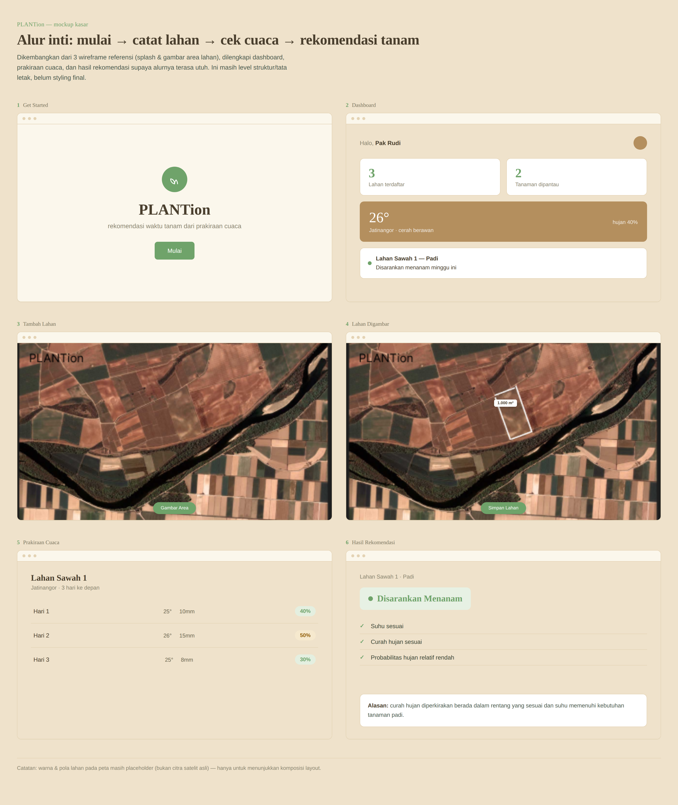

# 🌱 PLANTion : Rekomendasi Waktu Tanam Berdasarkan Prakiraan Cuaca

PLANTion adalah aplikasi berbasis web yang membantu petani menentukan **waktu tanam yang lebih sesuai berdasarkan prakiraan cuaca dan kebutuhan cuaca tanaman**.

Sistem mengambil data prakiraan cuaca berdasarkan lokasi lahan, kemudian membandingkannya dengan kebutuhan cuaca tanaman menggunakan **rule-based logic**. Hasil analisis ditampilkan dalam bentuk rekomendasi sederhana seperti **"Disarankan Menanam"**, **"Pertimbangkan"**, atau **"Tunda Menanam"**.

Project ini dikembangkan sebagai bentuk penerapan **SDG 2.4**, khususnya dalam mendukung praktik pertanian yang lebih berkelanjutan dan tahan terhadap perubahan iklim.

---

# 🌾 Tentang Project

**PLANTion** dirancang untuk membantu petani dalam mengambil keputusan sederhana terkait waktu tanam.

Petani dapat:

* mendaftarkan akun,
* menambahkan data lahan,
* menentukan lokasi lahan,
* memilih jenis tanaman,
* melihat prakiraan cuaca,
* mendapatkan rekomendasi waktu tanam,
* dan melihat riwayat rekomendasi.

Data cuaca diperoleh dari API cuaca berdasarkan koordinat lokasi lahan. Sistem kemudian melakukan analisis berdasarkan aturan yang telah ditentukan untuk setiap jenis tanaman.

---

# 🌦️ Latar Belakang

Kondisi cuaca merupakan salah satu faktor yang berpengaruh terhadap kegiatan pertanian. Hujan yang terlalu tinggi, suhu yang tidak sesuai, maupun kondisi cuaca yang kurang mendukung dapat memengaruhi keberhasilan proses penanaman.

Namun, tidak semua petani memiliki akses terhadap informasi cuaca yang mudah dipahami dan dikaitkan langsung dengan kebutuhan tanaman.

Oleh karena itu, **PLANTion** dibuat untuk menghubungkan informasi prakiraan cuaca dengan kebutuhan cuaca tanaman sehingga menghasilkan rekomendasi yang lebih sederhana dan mudah dipahami.

---

# ⚙️ Fungsi

PLANTion berfungsi untuk:

1. Mengelola akun dan data lahan petani.
2. Menampilkan prakiraan cuaca berdasarkan lokasi lahan.
3. Membandingkan kondisi cuaca dengan kebutuhan tanaman.
4. Memberikan rekomendasi waktu tanam berdasarkan rule-based system.
5. Menampilkan alasan dan menyimpan riwayat rekomendasi.
---

# 💡 Tujuan

Tujuan utama PLANTion adalah:

1. Membantu petani memperoleh informasi prakiraan cuaca berdasarkan lokasi lahannya.
2. Membantu petani menentukan waktu tanam berdasarkan kondisi cuaca.
3. Menghubungkan data cuaca dengan kebutuhan masing-masing tanaman.
4. Memberikan rekomendasi yang sederhana dan mudah dipahami.
5. Mendukung praktik pertanian yang lebih adaptif terhadap kondisi iklim.

---

# 🎯 Target Pengguna

Target pengguna PLANTion adalah petani maupun masyarakat atau individu yang ingin menanam tanaman dan membutuhkan informasi prakiraan cuaca sebagai pertimbangan dalam menentukan waktu tanam yang lebih sesuai.

---


# ✨ Fitur

## 👨‍🌾 Fitur Petani

### 1. Register & Login

Petani dapat membuat akun dan melakukan login untuk mengakses sistem.

### 2. Dashboard

Dashboard menampilkan informasi utama seperti:

* jumlah lahan,
* tanaman yang sedang dipantau,
* kondisi cuaca,
* rekomendasi terbaru.

### 3. Kelola Lahan

Petani dapat:

* menambahkan lahan,
* mengubah data lahan,
* menghapus lahan,
* melihat lokasi lahan.

Data lahan dapat terdiri dari:

* nama lahan,
* lokasi,
* luas lahan,
* latitude,
* longitude.

### 4. Pilih Tanaman

Petani dapat memilih tanaman yang akan ditanam pada lahan tertentu.

Contoh:

* Padi
* Jagung
* Cabai
* Tomat
* Kedelai

### 5. Prakiraan Cuaca

Sistem mengambil data prakiraan cuaca berdasarkan koordinat lahan.

Informasi yang dapat ditampilkan:

* tanggal,
* suhu minimum,
* suhu maksimum,
* curah hujan,
* probabilitas hujan,
* kondisi cuaca.

### 6. Rekomendasi Waktu Tanam ⭐

Sistem menganalisis prakiraan cuaca dan kebutuhan tanaman menggunakan aturan yang telah ditentukan.

Contoh hasil:

> 🟢 **Disarankan Menanam**

atau

> 🟡 **Pertimbangkan Waktu Tanam**

atau

> 🔴 **Tunda Menanam**

### 7. Alasan Rekomendasi

Sistem memberikan alasan di balik rekomendasi.

Contoh:

> "Curah hujan diperkirakan berada dalam rentang yang sesuai dan suhu memenuhi kebutuhan tanaman."

atau:

> "Probabilitas hujan tinggi selama beberapa hari ke depan sehingga waktu tanam disarankan untuk ditunda."

### 8. Riwayat Rekomendasi

Petani dapat melihat rekomendasi yang sebelumnya telah dibuat.

Informasi dapat meliputi:

* tanggal rekomendasi,
* lokasi lahan,
* jenis tanaman,
* kondisi cuaca,
* hasil rekomendasi,
* alasan rekomendasi.

---

# 🔄 Alur Sistem

```text
                    ┌───────────────┐
                    │     Petani    │
                    └───────┬───────┘
                            │
                            ▼
                    ┌───────────────┐
                    │     Login     │
                    └───────┬───────┘
                            │
                            ▼
                    ┌───────────────┐
                    │ Pilih Lahan   │
                    └───────┬───────┘
                            │
                            ▼
                    ┌───────────────┐
                    │ Pilih Tanaman │
                    └───────┬───────┘
                            │
                            ▼
                 ┌─────────────────────┐
                 │ Ambil Data Cuaca API│
                 └──────────┬──────────┘
                            │
                            ▼
                 ┌─────────────────────┐
                 │ Analisis Rule-Based │
                 └──────────┬──────────┘
                            │
                            ▼
                 ┌─────────────────────┐
                 │     Rekomendasi     │
                 └──────────┬──────────┘
                            │
                            ▼
              ┌──────────────────────────┐
              │ Simpan ke Riwayat Sistem│
              └──────────────────────────┘
```

---

# 🧠 Rule-Based Recommendation

PLANTion menggunakan pendekatan **rule-based system**.

Sistem tidak melakukan prediksi menggunakan machine learning. Sebaliknya, sistem menggunakan aturan yang telah ditentukan berdasarkan kebutuhan cuaca tanaman.

### Contoh aturan

Misalnya tanaman **padi** memiliki kondisi:

```text
Suhu ideal       : 20°C - 30°C
Curah hujan      : 5 - 50 mm/hari
Probabilitas hujan: < 80%
```

Kemudian sistem melakukan pengecekan.

### Rule 1 — Kondisi Baik

```text
Jika:
20 <= suhu <= 30
DAN
5 <= curah_hujan <= 50
DAN
probabilitas_hujan < 80%

Maka:
REKOMENDASI = "Disarankan Menanam"
```

### Rule 2 — Hujan Tinggi

```text
Jika:
curah_hujan > 50 mm

Maka:
REKOMENDASI = "Tunda Menanam"
```

### Rule 3 — Probabilitas Hujan Tinggi

```text
Jika:
probabilitas_hujan >= 80%

Maka:
REKOMENDASI = "Tunda Menanam"
```

### Rule 4 — Suhu Tidak Sesuai

```text
Jika:
suhu < suhu_minimum
ATAU
suhu > suhu_maksimum

Maka:
REKOMENDASI = "Pertimbangkan Waktu Tanam"
```

Aturan tersebut dapat dikembangkan menjadi sistem **scoring** agar rekomendasi tidak hanya bergantung pada satu kondisi.

---

# 📊 Contoh Scoring

Setiap kondisi dapat diberikan nilai:

| Kondisi                    | Score |
| -------------------------- | ----: |
| Suhu sesuai                |    +1 |
| Curah hujan sesuai         |    +1 |
| Probabilitas hujan rendah  |    +1 |
| Suhu tidak sesuai          |    -1 |
| Curah hujan terlalu tinggi |    -1 |
| Probabilitas hujan tinggi  |    -1 |

Kemudian:

```text
Score >= 2
→ Disarankan Menanam

Score = 0 atau 1
→ Pertimbangkan Waktu Tanam

Score < 0
→ Tunda Menanam
```

Metode ini membuat proses rekomendasi lebih mudah dijelaskan dan dikembangkan.

---

# 💻 Teknologi

Project ini dapat menggunakan:

### Frontend

* HTML5
* CSS3
* JavaScript
* Bootstrap

### Backend

* PHP
* PHP Native

### Database

* MySQL

### API

* Open-Meteo API

Alternatif:

* BMKG Open Data

### Development Environment

* XAMPP
* Apache
* MySQL
* Git
* GitHub

---

# 🗄️ Struktur Database

Database utama menggunakan beberapa tabel.

```text
users
│
├── id_user
├── nama
├── email
└── password

lokasi_lahan
│
├── id_lahan
├── id_user
├── nama_lahan
├── lokasi
├── luas
├── latitude
└── longitude

jenis_tanaman
│
├── id_tanaman
├── nama_tanaman
├── suhu_min
├── suhu_max
├── hujan_min
└── hujan_max

riwayat_cuaca
│
├── id_cuaca
├── id_lahan
├── tanggal
├── suhu_min
├── suhu_max
├── curah_hujan
├── probabilitas_hujan
└── kondisi_cuaca

rekomendasi_log
│
├── id_rekomendasi
├── id_lahan
├── id_tanaman
├── tanggal
├── hasil_rekomendasi
├── score
└── alasan
```

### Relasi

```text
users
  │
  │ 1 : N
  ▼
lokasi_lahan
  │
  │ 1 : N
  ▼
riwayat_cuaca


lokasi_lahan ──────┐
                   │
                   ▼
             rekomendasi_log
                   ▲
                   │
jenis_tanaman ─────┘
```

---

# 📁 Struktur Folder

Contoh struktur project:

```text
plantion/
│
├── assets/
│   ├── css/
│   │   └── style.css
│   │
│   ├── js/
│   │   └── script.js
│   │
│   └── images/
│
├── config/
│   └── database.php
│
├── auth/
│   ├── login.php
│   ├── register.php
│   └── logout.php
│
├── petani/
│   ├── dashboard.php
│   ├── lahan/
│   │   ├── index.php
│   │   ├── tambah.php
│   │   ├── edit.php
│   │   └── hapus.php
│   │
│   ├── cuaca/
│   │   └── index.php
│   │
│   └── rekomendasi/
│       ├── index.php
│       └── detail.php
│
├── api/
│   └── weather.php
│
├── functions/
│   ├── weather_function.php
│   └── recommendation.php
│
├── index.php
│
└── README.md
```

---

# Mockup Kasar


# 🌐 API Cuaca

PLANTion menggunakan API cuaca untuk memperoleh data berdasarkan koordinat lahan.

API yang dapat digunakan:

**Open-Meteo**

[Open-Meteo Documentation](https://open-meteo.com/en/docs?utm_source=chatgpt.com)

Open-Meteo dapat digunakan tanpa API key untuk penggunaan yang sesuai dengan ketentuannya.

Data yang digunakan oleh sistem dapat meliputi:

```text
temperature_2m_max
temperature_2m_min
precipitation_sum
precipitation_probability_max
weather_code
```

Contoh alur:

```text
Latitude + Longitude
        ↓
Open-Meteo API
        ↓
JSON Weather Data
        ↓
PHP
        ↓
Database
        ↓
Rule-Based System
        ↓
Rekomendasi
```

# 👨‍🌾 Contoh Penggunaan

### Langkah 1

Petani melakukan login.

### Langkah 2

Petani menambahkan lahan:

```text
Nama Lahan : Lahan Sawah 1
Lokasi     : Jatinangor
Luas       : 1000 m²
Latitude   : -6.xxxxx
Longitude  : 107.xxxxx
```

### Langkah 3

Petani memilih:

```text
Tanaman:
Padi
```

### Langkah 4

Sistem mengambil prakiraan cuaca.

Contoh:

```text
Hari 1
Suhu       : 25°C
Curah hujan: 10 mm
Peluang hujan: 40%

Hari 2
Suhu       : 26°C
Curah hujan: 15 mm
Peluang hujan: 50%

Hari 3
Suhu       : 25°C
Curah hujan: 8 mm
Peluang hujan: 30%
```

### Langkah 5

Sistem melakukan analisis berdasarkan aturan tanaman.

Hasil:

```text
REKOMENDASI

✓ Suhu sesuai
✓ Curah hujan sesuai
✓ Probabilitas hujan relatif rendah

Kesimpulan:
DISARANKAN MENANAM
```

---

# 🌍 SDG 2.4

PLANTion mendukung **Sustainable Development Goal (SDG) 2**, khususnya target **2.4**, yang berfokus pada sistem produksi pangan yang berkelanjutan dan praktik pertanian yang lebih adaptif terhadap perubahan iklim.

Aplikasi ini membantu dengan menyediakan informasi cuaca dan rekomendasi waktu tanam sehingga petani dapat mempertimbangkan kondisi lingkungan sebelum melakukan penanaman.


---

# 👨‍💻 Kontributor

Project **PLANTion** dikembangkan sebagai project akademik.

**Team:**

* 140810250011	Fayha Najla Rahman
* 140810250056	Khaled Meshaal Ahmadinejad Mujaddid Thariq Mardova Fadhilah
* 140810250062	Theresia Monica Emmanuella Situmeang
---


## 💡 Catatan

Rekomendasi yang diberikan PLANTion merupakan **rekomendasi berbasis aturan dan prakiraan cuaca**, bukan pengganti keputusan profesional di bidang pertanian. Kondisi aktual di lapangan dapat berbeda dari prakiraan.
